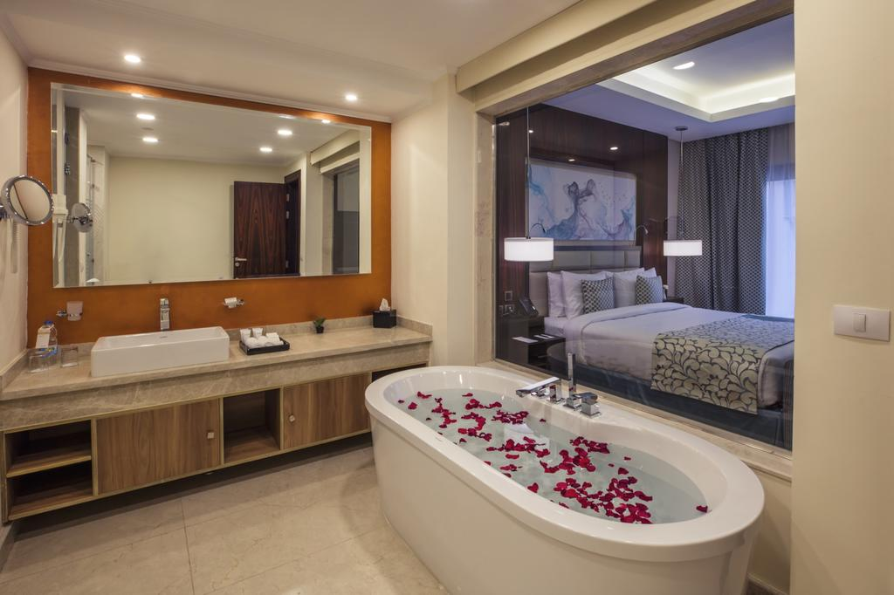

<!DOCTYPE html>
<html lang="en">
<head>
    <meta charset="UTF-8">
    <meta name="viewport" content="width=device-width, initial-scale=1.0">

    <!-- bootstrap -->
    
    
    
    <link rel="stylesheet" href="https://stackpath.bootstrapcdn.com/bootstrap/4.5.2/css/bootstrap.min.css" integrity="sha384-JcKb8q3iqJ61gNV9KGb8thSsNjpSL0n8PARn9HuZOnIxN0hoP+VmmDGMN5t9UJ0Z" crossorigin="anonymous">
    <link rel="stylesheet" href="https://stackpath.bootstrapcdn.com/font-awesome/4.7.0/css/font-awesome.min.css" integrity="sha384-wvfXpqpZZVQGK6TAh5PVlGOfQNHSoD2xbE+QkPxCAFlNEevoEH3Sl0sibVcOQVnN" crossorigin="anonymous">
    <link rel="stylesheet" href="style.css">

    <!-- chart.js -->
    

    

    <title>Landing Page</title>

</head>
<body>

        <!-- Side menu and all -->

        

            <button class="btn btn-transparent" id="arrow-up"><i class="fa fa-arrow-up fa-2x text-primary my-1"></i></button>
            <button class="bg-primary rounded-circle p-3 btn btn-primary" id="side-button">
                <i class="fa fa-bars"></i>
            </button>
            <button class="btn btn-transparent" id="arrow-down"><i class="fa fa-arrow-down fa-2x text-primary my-1"></i></button>
        

 
            

                

                    
                    <button class="btn btn-transparent text-white ml-auto" id="close"><i class="fa fa-times fa-2x"></i></button>
                

                <a href="#cover">
1. Cover Photo
</a>
                <a href="#subject">
2. Subject Property
</a>
                <a href="#property">
3. Property Information
</a>
                <a href="#listing">
4. Listing Location
</a>
                <a href="#side">
5. Side By Side Comparison
</a>
                <a href="#status">
6. Status Comparison
</a>
                <a href="#listingA">
7. Listing Average
</a>
                <a href="#priceD">
8. Price & Days on Market
</a>
                <a href="#priceS">
9. Price & Size
</a>
                <a href="#pricing">
10. Pricing Analysis
</a>
                <a href="#testimonials">
11. Testimonials
</a>
                <a href="#about">
12. About Me
</a>
                <a href="#thank">
13. Thank You
</a>
            

    <!-- Side menu and all -->
    

    <!-- loader -->

    

        

            

                
                <h3><strong>Our Brokerage is your Brokerage</strong></h3>
            

               

            

                
                

                    <h3>Preparing Your Presentation</h3> 
                    

                        

                        
                        

                        

                        

                        

                        

                    

                

                

                    
                    
Your Presentation Is Ready

                    <!-- <h3>Your Presentation Is Ready</h3>  -->

                    

                        
                            
                        
                    

                

                
            

                
        

    

    <!-- contact section -->
    <section data-number="3" data-text = "Subject Property" class="" id="cover" style="height: 100%; width: 100%;">
        
        
        

            

                
                

                    <h3><strong>Isaqquah Seller</strong></h3>
                    <h3><strong>24606 SE Old Black Nugget Rd,</strong></h3>
                    <h3><strong>Isaqquah, WA 98029</strong></h3>
                

                

                    

                        
                        

                            
                            <h3 class="mb-3">Victor Williams</h3>
                            
                            

                                <i class="fa fa-phone"></i>
                                <h5 class="ml-3">02 232 841 12</h5>
                            

                            

                                <i class="fa fa-envelope"></i>
                                <h5 class="ml-3">victorwilliams@demosite.com</h5>
                            

                            

                                <i class="fa fa-globe"></i>
                                <h5 class="ml-3">www.demosite.com</h5>
                            

                        

                    

                

            

        

    
    </section>
    <!-- contact section -->

    <!-- weird header -->
    

        

            

                <h5 id="subject">Subject Porperty</h5>
                
/14

            

            

                
            

            

                
                
Victor Williams

            

        

    

    <!-- weird header -->

    <!-- subject prpoerty -->
    <section data-number="3" data-text = "Subject Property" class="position-relative" id="subject" style="height: 100%; width: 100%;">

        

        
        

            

                
                

                    <h3>Agence Remarks</h3>
                    
Lorem ipsum dolor sit amet consectetur adipisicing elit. Facilis ullam dolore nostrum vitae omnis necessitatibus illo quos aut rem, doloremque, odio sequi ipsam sint! Distinctio itaque accusantium voluptates repudiandae totam!Lorem Lorem ipsum dolor sit amet, consectetur adipisicing elit. Hic laborum voluptatum modi sed ut rerum est magnam eligendi aut quos minima esse odit voluptatibus assumenda alias quia, explicabo vel nostrum?

                

                

                    <h3>24606 SE Old Black Nugget Rd, Isaqquah, WA 98029</h3>
                
                    

                        

                            <i class="fa fa-bed fa-3x"></i>
                            <h4>Bed</h4>
                            <h4>5</h4>
                        

                        

                            <i class="fa fa-bath fa-3x"></i>
                            <h4>Bath</h4>
                            <h4>5</h4>
                        

                        
                        

                            <i class="fa fa-pencil fa-3x"></i>
                            <h4>Sq Ft</h4>
                            <h4>3,574</h4>
                        

                        
                        

                            <i class="fa fa-square-o fa-3x"></i>
                            <h4>Lot Size</h4>
                            <h4>0.58 Acres</h4>
                        

                    

                

            

        

    
    </section>
    <!-- subject prpoerty -->

    

    <!-- Property Information -->
    <section data-number="4" data-text = "Property Information" class="position-relative" id="property">

        

        

            

                

                    
                    
                

                

                    

                        
<strong>Property Type</strong>

                        
Single Family

                    

                    

                        
<strong>Year Built</strong>

                        
1992

                    

                    

                        
<strong>Country</strong>

                        
King Country

                    

                    

                        
<strong>Community</strong>

                        
Isaqquah

                    

                    

                        
<strong>Senior Community</strong>

                        
No

                    

                    

                        
<strong>Subdivision</strong>

                        
Cantergrove

                    

                    

                        
<strong>MLS Area</strong>

                        
540

                    

                    

                        
<strong>School District</strong>

                        
Iss

                    

                    

                        
<strong>Elementary School</strong>

                        
Grand Ridge Elem

                    

                    

                        
<strong>Middle School</strong>

                        
Ppacific Cascade Mid

                    

                    

                        
<strong>High School</strong>

                        
Issaquah High

                    

                    

                        
<strong>Tax Amount</strong>

                        
$33,427

                    

                

            

        

    
    </section>
    <!-- Property Information -->

    

    <!-- Using Location -->
    <section data-number="5" data-text = "Listing Location" class="position-relative pt-5" id="listing">

        

        

            
            
     
                

                

                    
<iframe width="100%" height="600" frameborder="0" scrolling="no" marginheight="0" marginwidth="0" src="https://maps.google.com/maps?width=100%25&amp;height=600&amp;hl=en&amp;q=des%20moines+(My%20Business%20Name)&amp;t=&amp;z=14&amp;ie=UTF8&amp;iwloc=B&amp;output=embed"></iframe>

                

                

                    

                        
                        
                        

                            

                                
                                

                                    
<strong>$995,000</strong>

                                    
<strong>#2</strong>

                                

                                

                                    <i class="fa fa-star fa-2x text-white"></i>
                                

                            

                            
                            

                                
229 229 229 229

                                
Lorem ipsum dolor sit amet consectetur adipisicing elit. Illum error, consequuntur re

                            

                        

                        

                            

                                
                                

                                    
<strong>$995,000</strong>

                                    
<strong>#2</strong>

                                

                                

                                    <i class="fa fa-check-circle fa-2x text-white"></i>
                                

                            

                            
                            

                                
229 229 229 229

                                
Lorem ipsum dolor sit amet consectetur adipisicing elit. Illum error, consequuntur re

                            

                        

                        

                            

                                
                                

                                    
<strong>$995,000</strong>

                                    
<strong>#2</strong>

                                

                                

                                    <i class="fa fa-check-circle fa-2x text-white"></i>
                                

                            

                            
                            

                                
229 229 229 229

                                
Lorem ipsum dolor sit amet consectetur adipisicing elit. Illum error, consequuntur re

                            

                        

                        

                            

                                
                                

                                    
<strong>$995,000</strong>

                                    
<strong>#2</strong>

                                

                                

                                    <i class="fa fa-check-circle fa-2x text-white"></i>
                                

                            

                            
                            

                                
229 229 229 229

                                
Lorem ipsum dolor sit amet consectetur adipisicing elit. Illum error, consequuntur re

                            

                        

                    

                

            

       
        

        
    
    </section>
    <!-- Using Location -->

    

    <!-- Side By Side Comparison -->
    <section data-number="6" data-text = "Side By Side Comparison" class="position-relative" id="side">

        

        

            

                
                

                    

                        
                        

                            
<strong>$995,000</strong>

                            
<strong>#2</strong>

                        

                        

                            <i class="fa fa-star fa-2x text-white"></i>
                        

                    

                    
                    

                        
229 229 229 229

                        
Lorem ipsum dolor sit amet consectetur adipisicing elit. Illum error, consequuntur re

                        

                            
<strong>MLS #</strong>

                            
13485910

                        

                        

                            
<strong>PROPERTY TYPE</strong>

                            
Single-Family

                        

                        

                            
<strong>BEDROOMS</strong>

                            
5

                        

                        

                            
<strong>BATHROOM DETAILS</strong>

                            
Full Bath 2, Three Quarter Bath 2, Half Bath 2

                        

                        

                            
<strong>SOFT</strong>

                            
6,850

                        

                        

                            
<strong>LOT SOFT</strong>

                            
205,203

                        

                        

                            
<strong>LOT DIMENSION</strong>

                            
-

                        

                    

                    
                    

                

                

                    

                        
                        

                            
<strong>$995,000</strong>

                            
<strong>#2</strong>

                        

                        

                            <i class="fa fa-star fa-2x text-white"></i>
                        

                    

                    
                    

                        
229 229 229 229

                        
Lorem ipsum dolor sit amet consectetur adipisicing elit. Illum error, consequuntur re

                        

                            
<strong>MLS #</strong>

                            
13485910

                        

                        

                            
<strong>PROPERTY TYPE</strong>

                            
Single-Family

                        

                        

                            
<strong>BEDROOMS</strong>

                            
5

                        

                        

                            
<strong>BATHROOM DETAILS</strong>

                            
Full Bath 2, Three Quarter Bath 2, Half Bath 2

                        

                        

                            
<strong>SOFT</strong>

                            
6,850

                        

                        

                            
<strong>LOT SOFT</strong>

                            
205,203

                        

                        

                            
<strong>LOT DIMENSION</strong>

                            
-

                        

                    

                    
                    

                

                

                    

                        
                        

                            
<strong>$995,000</strong>

                            
<strong>#2</strong>

                        

                        

                            <i class="fa fa-star fa-2x text-white"></i>
                        

                    

                    
                    

                        
229 229 229 229

                        
Lorem ipsum dolor sit amet consectetur adipisicing elit. Illum error, consequuntur re

                        

                            
<strong>MLS #</strong>

                            
13485910

                        

                        

                            
<strong>PROPERTY TYPE</strong>

                            
Single-Family

                        

                        

                            
<strong>BEDROOMS</strong>

                            
5

                        

                        

                            
<strong>BATHROOM DETAILS</strong>

                            
Full Bath 2, Three Quarter Bath 2, Half Bath 2

                        

                        

                            
<strong>SOFT</strong>

                            
6,850

                        

                        

                            
<strong>LOT SOFT</strong>

                            
205,203

                        

                        

                            
<strong>LOT DIMENSION</strong>

                            
-

                        

                    

                    
                    

                

                

                    

                        
                        

                            
<strong>$995,000</strong>

                            
<strong>#2</strong>

                        

                        

                            <i class="fa fa-star fa-2x text-white"></i>
                        

                    

                    
                    

                        
229 229 229 229

                        
Lorem ipsum dolor sit amet consectetur adipisicing elit. Illum error, consequuntur re

                        

                            
<strong>MLS #</strong>

                            
13485910

                        

                        

                            
<strong>PROPERTY TYPE</strong>

                            
Single-Family

                        

                        

                            
<strong>BEDROOMS</strong>

                            
5

                        

                        

                            
<strong>BATHROOM DETAILS</strong>

                            
Full Bath 2, Three Quarter Bath 2, Half Bath 2

                        

                        

                            
<strong>SOFT</strong>

                            
6,850

                        

                        

                            
<strong>LOT SOFT</strong>

                            
205,203

                        

                        

                            
<strong>LOT DIMENSION</strong>

                            
-

                        

                    

                    
                    

                

            

        

    
    </section>
    <!-- Side By Side Comparison -->

    

    <!-- Status Comparison -->
    <section data-number="7" data-text = "Status Comparison" class="position-relative py-5" id="status">

       

        

            <!-- first accordion -->
            

              

                <h5 class="mb-0">
                  <button class="btn btn-link bg-primary text-white w-100" data-toggle="collapse" data-target="#collapseOne" aria-expanded="true" aria-controls="collapseOne">
                    
                    

                        

                            
ACTIVE

                            
BED

                            
BATH

                            
SQFT

                            
$/SQFT

                            
LOT SQFT

                            
$/LOT SQFT

                            
LIST PRICE

                        

                    

                  
                  </button>
                </h5>
              

          
              

                

                    

                        

                            

                                
                                
Lorem ipsum dolor sit amet consectetur a volupt

                            

                            
5

                            
6

                            
$6,580

                            
$425

                            
404,237

                            
$14

                            
$2,742

                        

                    

                

              

              

                

                    

                        

                            

                                
                                
Lorem ipsum dolor sit amet consectetur a volupt

                            

                            
5

                            
6

                            
$6,580

                            
$425

                            
404,237

                            
$14

                            
$2,742

                        

                    

                

              

              

                

                    

                        

                            

                                
                                
Lorem ipsum dolor sit amet consectetur a volupt

                            

                            
5

                            
6

                            
$6,580

                            
$425

                            
404,237

                            
$14

                            
$2,742

                        

                    

                

              

              <!-- second accordion -->

              

                

                  <h5 class="mb-0">
                    <button class="btn btn-link bg-primary text-white w-100" data-toggle="collapse" data-target="#collapseTwo" aria-expanded="true" aria-controls="collapseTwo">
                      
                      

                          

                              
PENDING

                              
BED

                              
BATH

                              
SQFT

                              
$/SQFT

                              
LOT SQFT

                              
$/LOT SQFT

                              
LIST PRICE

                          

                      

                    
                    </button>
                  </h5>
                

            
                

                  

                      

                          

                              

                                  
                                  
Lorem ipsum dolor sit amet consectetur a volupt

                              

                              
5

                              
6

                              
$6,580

                              
$425

                              
404,237

                              
$14

                              
$2,742

                          

                      

                  

                

  
  
                

                  

                      

                          

                              

                                  
                                  
Lorem ipsum dolor sit amet consectetur a volupt

                              

                              
5

                              
6

                              
$6,580

                              
$425

                              
404,237

                              
$14

                              
$2,742

                          

                      

                  

                

  
  
                

                  

                      

                          

                              

                                  
                                  
Lorem ipsum dolor sit amet consectetur a volupt

                              

                              
5

                              
6

                              
$6,580

                              
$425

                              
404,237

                              
$14

                              
$2,742

                          

                      

                  

                

                

                    

                      <h5 class="mb-0">
                        <button class="btn btn-link bg-primary text-white w-100" data-toggle="collapse" data-target="#collapseThree" aria-expanded="true" aria-controls="collapseThree">
                          
                            <!-- third accordion -->

                          

                              

                                  
SOLD

                                  
BED

                                  
BATH

                                  
SQFT

                                  
$/SQFT

                                  
LOT SQFT

                                  
$/LOT SQFT

                                  
LIST PRICE

                              

                          

                        
                        </button>
                      </h5>
                    

                
                    

                      

                          

                              

                                  

                                      
                                      
Lorem ipsum dolor sit amet consectetur a volupt

                                  

                                  
5

                                  
6

                                  
$6,580

                                  
$425

                                  
404,237

                                  
$14

                                  
$2,742

                              

                          

                      

                    

      
      
                    

                      

                          

                              

                                  

                                      
                                      
Lorem ipsum dolor sit amet consectetur a volupt

                                  

                                  
5

                                  
6

                                  
$6,580

                                  
$425

                                  
404,237

                                  
$14

                                  
$2,742

                              

                          

                      

                    

      
      
                    

                      

                          

                              

                                  

                                      
                                      
Lorem ipsum dolor sit amet consectetur a volupt

                                  

                                  
5

                                  
6

                                  
$6,580

                                  
$425

                                  
404,237

                                  
$14

                                  
$2,742

                              

                          

                      

                    

        

              

                <h5 class="mb-0">
                  <button class="btn btn-link bg-primary text-white w-100" data-toggle="collapse" data-target="#collapseFour" aria-expanded="true" aria-controls="collapseFour">
                    
                <!-- fourth accordion -->
                    

                        

                            
OTHERS

                            
BED

                            
BATH

                            
SQFT

                            
$/SQFT

                            
LOT SQFT

                            
$/LOT SQFT

                            
LIST PRICE

                        

                    

                  
                  </button>
                </h5>
              

          
              

                

                    

                        

                            

                                
                                
Lorem ipsum dolor sit amet consectetur a volupt

                            

                            
5

                            
6

                            
$6,580

                            
$425

                            
404,237

                            
$14

                            
$2,742

                        

                    

                

              

              

                

                    

                        

                            

                                
                                
Lorem ipsum dolor sit amet consectetur a volupt

                            

                            
5

                            
6

                            
$6,580

                            
$425

                            
404,237

                            
$14

                            
$2,742

                        

                    

                

              

              

                

                    

                        

                            

                                
                                
Lorem ipsum dolor sit amet consectetur a volupt

                            

                            
5

                            
6

                            
$6,580

                            
$425

                            
404,237

                            
$14

                            
$2,742

                        

                    

                

              

        

    </section>
    <!-- Status Comparison -->

    

    <!-- Listing Average -->
    <section data-number="8" data-text = "Listing Average" class="position-relative" style="height: 100%; width: 100%" id="listingA">
        
         

        

            

                

                    <h3>Pricing</h3> 
                    
                    

                        

                            
Low

                        

                        

                            

                        

                        

                            
$1,950,000

                        

                    

                     

                    

                        

                            
Avg

                        

                        

                            

                        

                        

                            
$2,350,000

                        

                    

                     
                    

                        

                            
Med

                        

                        

                            

                        

                        

                            
$2,150,000

                        

                    

                     
                    

                        

                            
High

                        

                        

                            

                        

                        

                            
$3,150,000

                        

                    

                

                

                    <h3 class="text-center">Home Averages</h3>
                      
                    

                        

                            
SQFT

                            <h4 class="mb-0">5,020</h4>
                        

                        

                            
LOT SQFT

                            <h4 class="mb-0">74527</h4>
                        

                    

 
                    

                        

                            
DAYS ON MARKET

                            <h4 class="mb-0">58</h4>
                        

                        

                            
$/SQFT

                            <h4 class="mb-0">$501</h4>
                        

                    

                

            

        

    </section>
    <!-- Listing Average -->

    

    <!-- Price & Days on Market -->
    <section data-number="9" data-text = "Price & Days on Market" class="position-relative" id="priceD">
        
        

      <canvas id="canvas1" class="container position-relative py-5 mt-5" >
          
      </canvas>
      
      <!-- 

 -->
  </section>
    <!-- Price & Days on Market -->

    

    <!-- Price & Size -->
    <section data-number="10" data-text = "Price & Size" class="position-relative" id="priceS">
        
      

      <canvas id="canvas2" class="container position-relative py-5 mt-5" >
          
      </canvas>
      <!-- 

 -->
  </section>
    <!-- Price & Size -->

    

    <!-- Pricing Analysis -->

     <section data-number="11" data-text = "Pricing Analysis" class="position-relative" style="height: 100%; width: 100%;" id="pricing">

        

       
        <!-- weird header -->

        
        

            

                
                

                    <h4 class="text-center"><strong>Approximate Market Value</strong></h4>
                     
                    

                        <h5>Pricing Stats</h5>
                        
Lorem ipsum dolor sit amet consectetur adipisicing elit. Consequuntur tempore consectetur exercitationem voluptate, voluptatum, id optio dolores 

                    

                    

                    

                        <h5>Price Based On Average Sales</h5>
                        

                            
Lorem ipsum dolor sit amet consectetur adipisicing elit. 

                            
<strong>$3,569,600</strong>

                        

                    

                    

                    

                        <h5>Price Based On Average Sales</h5>
                        

                            
Lorem ipsum dolor sit amet consectetur adipisicing elit.

                            
<strong>$3,569,600</strong>

                        

                        

                            
Lorem ipsum dolor sit amet consectetur adipisicing elit.

                            
<strong>$3,569,600</strong>

                        

                        

                            
Lorem ipsum dolor sit amet consectetur adipisicing elit.

                            
<strong>$3,569,600</strong>

                        

                    

                    

                

            

        

    
    </section>

    <!-- Pricing Analysis -->

    

     <!-- Testimonials -->

     <section data-number="12" data-text = "Testimonials" class="position-relative " id="testimonials">
        
       
        

        
        

            <h3 class="text-center my-5">Customer Success Stories</h3>
            

                

                  

                    
                    

                        

                            

                                

                                    
                                

                            
                                

                                    <h1 class="mb-0" style="font-size:60px"></h1>

                                    
Lorem ipsum dolor sit amet consectetur adipisicing elit. Laudantium maxime aliquid consequuntur illum eveniet cupiditate deserunt sed sapiente iure quasi rerum pariatur corporis aliquam ad, sunt, quos facilis, dignissimos rem.

                                

                            
                            

                            
 

                                

                                    
                                

                            
                                

                                    <h1 class="mb-0" style="font-size:60px"></h1>

                                    
Lorem ipsum dolor sit amet consectetur adipisicing elit. Laudantium maxime aliquid consequuntur illum eveniet cupiditate deserunt sed sapiente iure quasi rerum pariatur corporis aliquam ad, sunt, quos facilis, dignissimos rem.

                                

                            
                            

                            

                                

                                    
                                

                            
                                

                                    <h1 class="mb-0" style="font-size:60px"></h1>

                                    
Lorem ipsum dolor sit amet consectetur adipisicing elit. Laudantium maxime aliquid consequuntur illum eveniet cupiditate deserunt sed sapiente iure quasi rerum pariatur corporis aliquam ad, sunt, quos facilis, dignissimos rem.

                                

                            
                            

                        

                    

                  

                  

                    
                    
                    

                        

                            

                                

                                    
                                

                            
                                

                                    <h1 class="mb-0" style="font-size:60px"></h1>

                                    
Lorem ipsum dolor sit amet consectetur adipisicing elit. Laudantium maxime aliquid consequuntur illum eveniet cupiditate deserunt sed sapiente iure quasi rerum pariatur corporis aliquam ad, sunt, quos facilis, dignissimos rem.

                                

                            
                            

                            
 

                                

                                    
                                

                            
                                

                                    <h1 class="mb-0" style="font-size:60px"></h1>

                                    
Lorem ipsum dolor sit amet consectetur adipisicing elit. Laudantium maxime aliquid consequuntur illum eveniet cupiditate deserunt sed sapiente iure quasi rerum pariatur corporis aliquam ad, sunt, quos facilis, dignissimos rem.

                                

                            
                            

                            

                                

                                    
                                

                            
                                

                                    <h1 class="mb-0" style="font-size:60px"></h1>

                                    
Lorem ipsum dolor sit amet consectetur adipisicing elit. Laudantium maxime aliquid consequuntur illum eveniet cupiditate deserunt sed sapiente iure quasi rerum pariatur corporis aliquam ad, sunt, quos facilis, dignissimos rem.

                                

                            
                            

                        

                    

                  

                  

                    
                    
                    

                        

                            

                                

                                    
                                

                            
                                

                                    <h1 class="mb-0" style="font-size:60px"></h1>

                                    
Lorem ipsum dolor sit amet consectetur adipisicing elit. Laudantium maxime aliquid consequuntur illum eveniet cupiditate deserunt sed sapiente iure quasi rerum pariatur corporis aliquam ad, sunt, quos facilis, dignissimos rem.

                                

                            
                            

                            
 

                                

                                    
                                

                            
                                

                                    <h1 class="mb-0" style="font-size:60px"></h1>

                                    
Lorem ipsum dolor sit amet consectetur adipisicing elit. Laudantium maxime aliquid consequuntur illum eveniet cupiditate deserunt sed sapiente iure quasi rerum pariatur corporis aliquam ad, sunt, quos facilis, dignissimos rem.

                                

                            
                            

                            

                                

                                    
                                

                            
                                

                                    <h1 class="mb-0" style="font-size:60px"></h1>

                                    
Lorem ipsum dolor sit amet consectetur adipisicing elit. Laudantium maxime aliquid consequuntur illum eveniet cupiditate deserunt sed sapiente iure quasi rerum pariatur corporis aliquam ad, sunt, quos facilis, dignissimos rem.

                                

                            
                            

                        

                    

                  

                

                
                <a class="carousel-control-prev" href="#carouselExampleControls" role="button" data-slide="prev">
                    
                    Previous
                  </a>
                  <a class="carousel-control-next" href="#carouselExampleControls" role="button" data-slide="next">
                    
                    Next
                </a>

              

                
            

               
    </section>

    <!-- Testimonials -->

    

    <!-- About Me -->

    <section data-number="13" data-text = "About Me" class="position-relative" id="about">

        
        

            

                
                

                    

                        
                    

                

                

                    <h4>Victor Williams</h4>
                     
                    <h5>Head of Investments</h5>
                     
                    <h5>Background</h5>
                    
Lorem ipsum dolor sit amet consectetur adipisicing elit. Inventore aut, minus, dicta dolore assumenda eligendi iure quidem id, labore vel accusantium. Placeat a ipsum atque perspiciatis fugit necessitatibus laboriosam consequatur.

                     
                    <h5>Training and Expertise</h5>
                    
Lorem ipsum dolor sit amet consectetur adipisicing elit. Sint harum doloribus itaque distinctio porro fuga est. Expedita iusto, harum iste recusandae quam, ex nihil totam quasi temporibus nobis distinctio tempore.

                

            

        

    
    </section>

    <!-- About Me -->

    

     <!-- Thank You -->

     <section data-number="14" data-text = "Thank You" class="position-relative" id="thank">

        
        

            

                
                

                    <h1 class="text-primary" style="font-size: 60px"><strong>Thank You</strong></h1>
                    
Get In Touch

                    

                

                

                    <h5>MAILING ADDRESS</h5>
                    
24606 SE Old Black Nugget Rd, Issaquah, WA 98028

                     
                    <h5>EMAIL ADDRESS</h5>
                    
victorwilliams@realestate.com

                     
                    <h5>PHONE NUMBER</h5>
                    
0798 898 389

                     

                

            

        

    
    </section>

    <!-- Thank You -->

    <!-- custom JS -->
    

</body>
</html>

